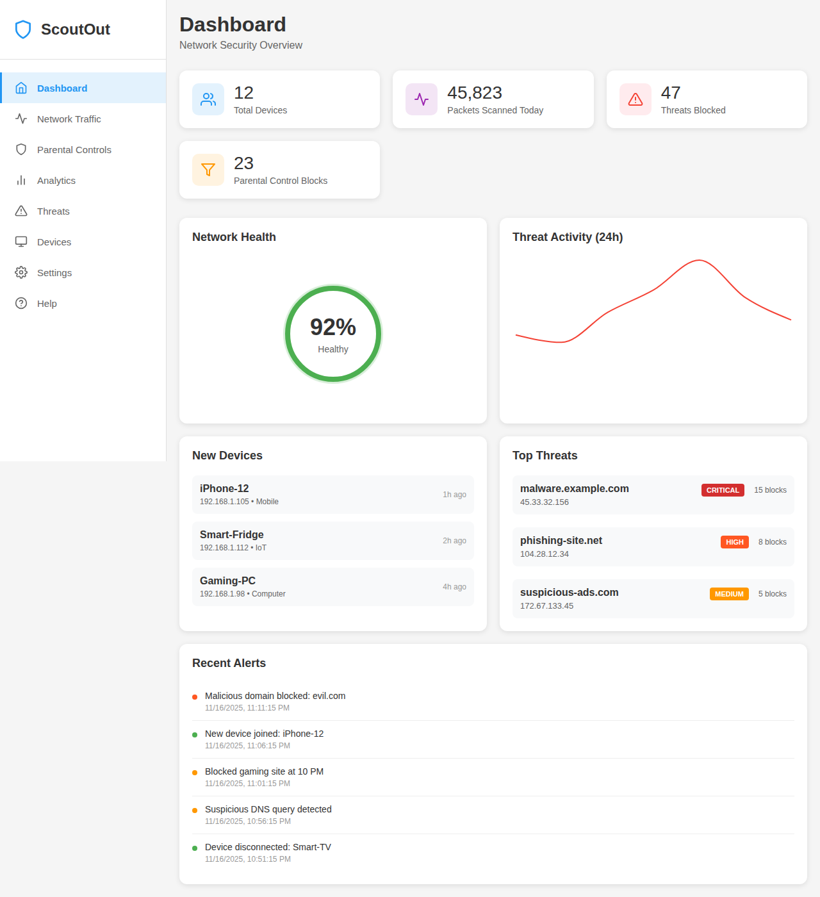
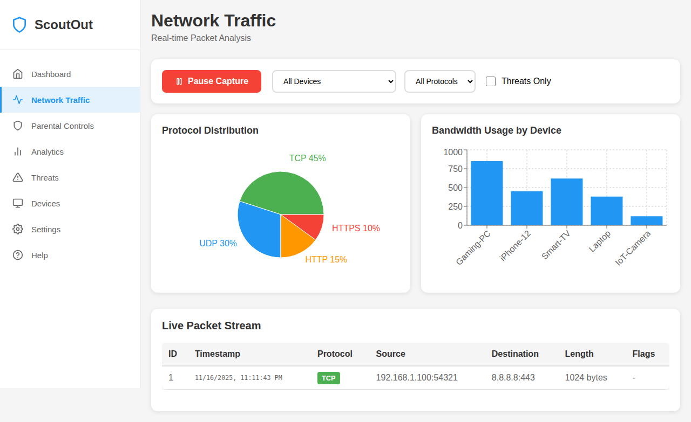
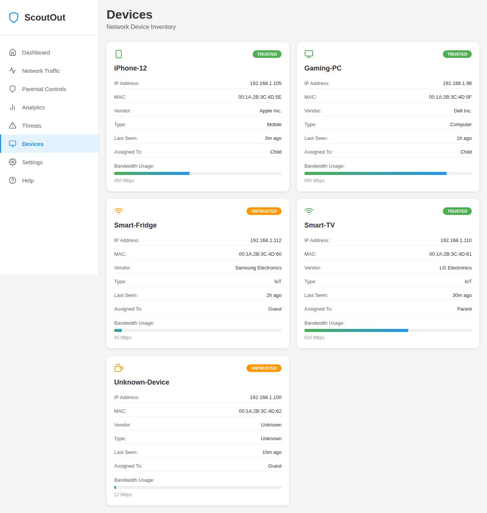
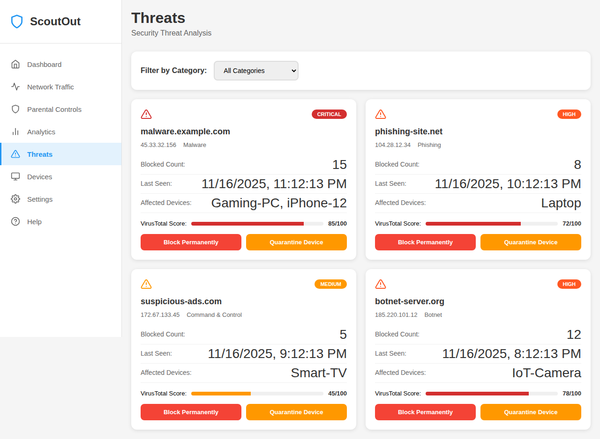
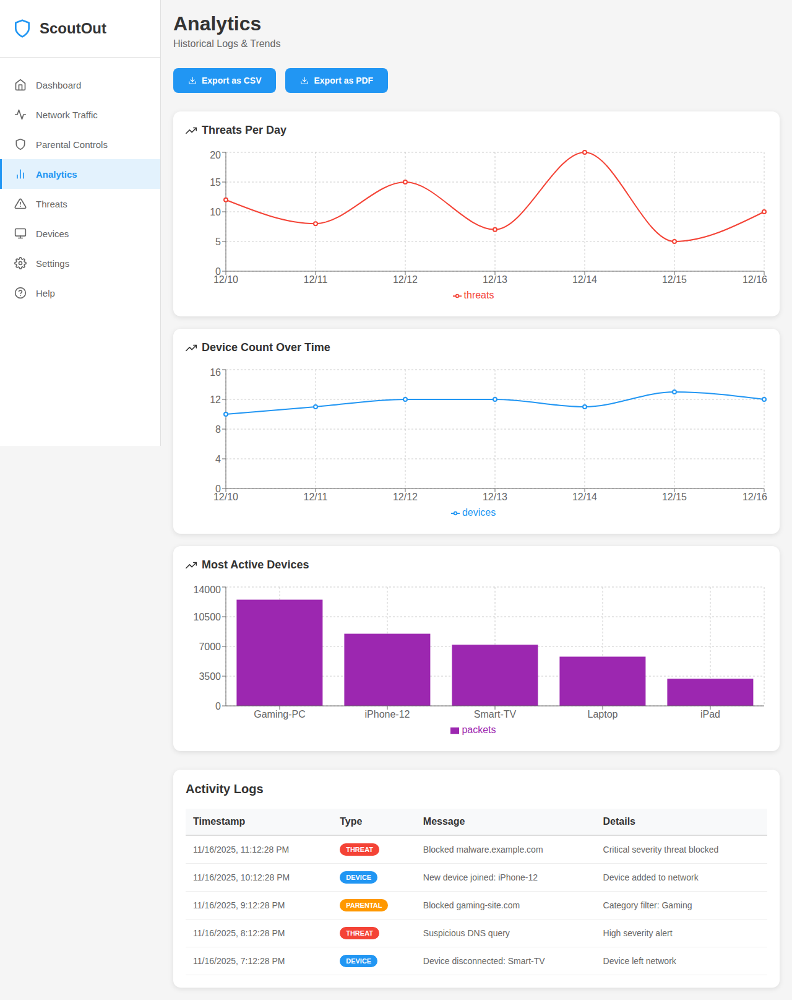
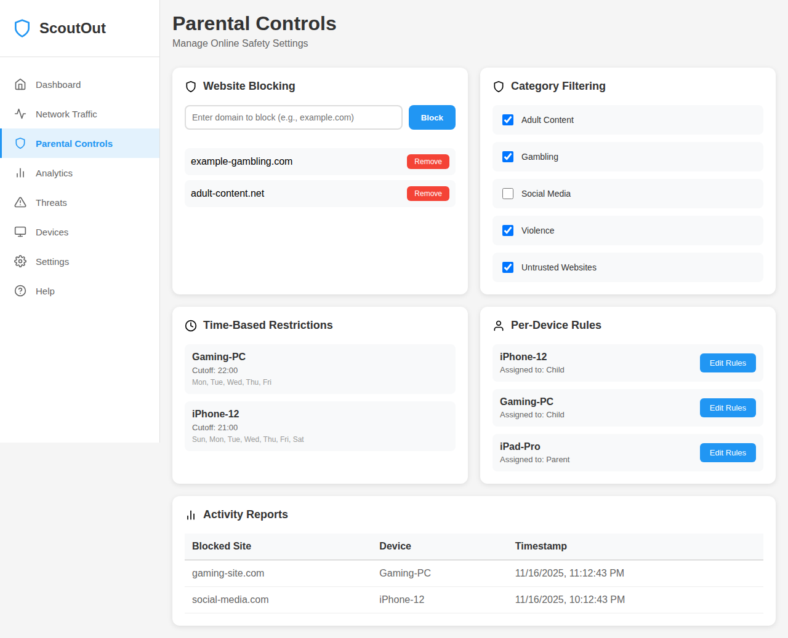
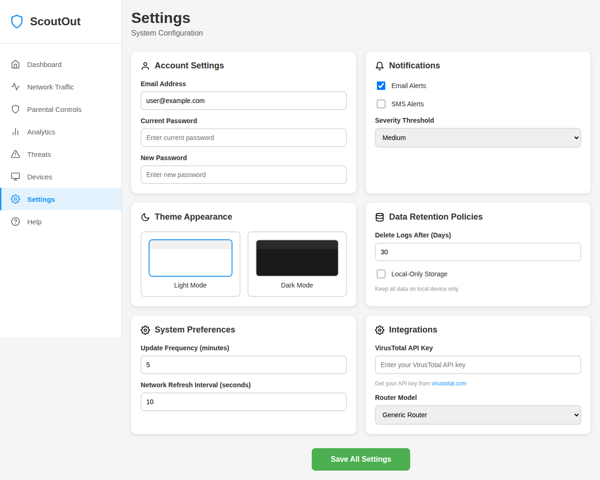
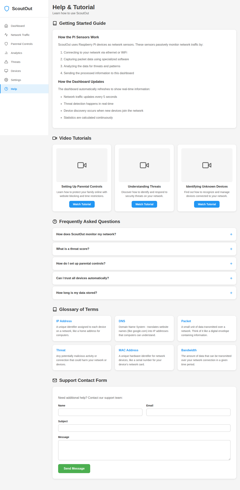

# ScoutOut Screenshots

This directory contains screenshots of the ScoutOut application showing its various features.

## Screenshots

### Dashboard

*Main dashboard showing network security overview with device stats, network health, threat activity, new devices, and recent alerts*

### Network Traffic

*Wireshark-style packet analyzer with protocol distribution charts, bandwidth usage, and live packet stream*

### Devices

*Network device inventory showing all connected devices with trust levels, bandwidth usage, and device details*

### Threats

*Security threat analysis page displaying detected threats with severity levels and VirusTotal scores*

### Analytics

*Historical logs and trends showing threats per day, device count over time, and activity logs*

### Parental Controls

*Website blocking, category filtering, time-based restrictions, and per-device rules management*

### Settings

*System configuration including account settings, notifications, theme, data retention, and integrations*

### Help

*Help and tutorial page with getting started guide, video tutorials, FAQ, and glossary of terms*

## Usage

These screenshots can be referenced in documentation, README files, or pull requests to showcase the application's features and user interface.
